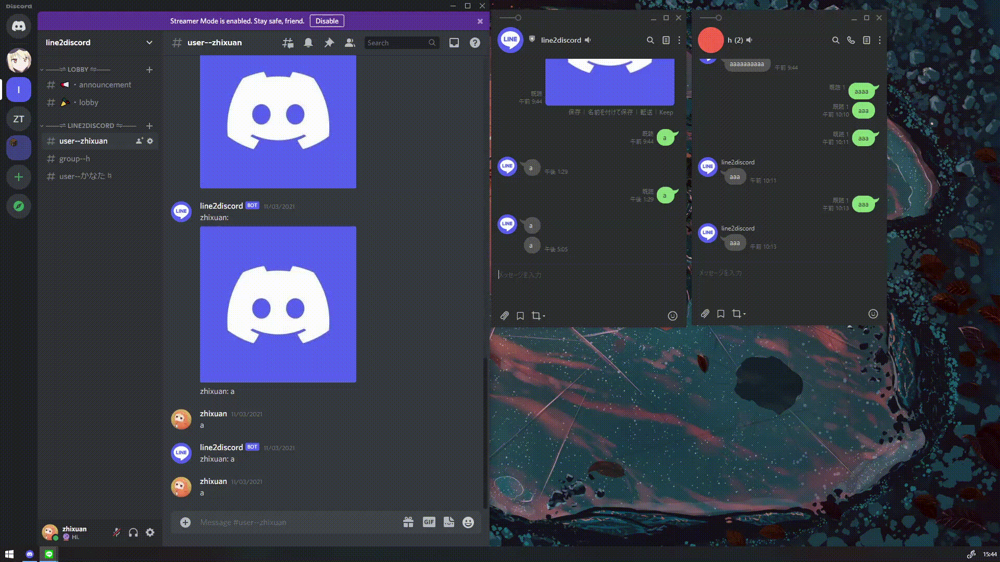

[](https://github.com/zhixuan2333/line2discord/issues)
[](./LICENSE)
[](https://twitter.com/zhixuan2333)

<div align="center">
  <a href="https://github.com/zhixuan2333/line2discord">
    
  </a>

  <h3 align="center">line2discord</h3>

  <p align="center">
    A bot to connects LINE to Discord.
    <br />
    <a href="https://github.com/zhixuan2333/line2discord/blob/master/docs/quickstart.md"><strong>Explore the docs »</strong></a>
    <!-- <br />
    <br />
    <a href="https://github.com/zhixuan2333/line2discord/issues">Report Bug</a>
    ·
    <a href="https://github.com/zhixuan2333/line2discord/issues">Request Feature</a> -->
  </p>
</div>

## Preview



## Getting Started

See [quickstart.md](./docs/quickstart.md)

## features

-   Line --> Discord
    -   [x] Message
    -   [x] Image
    -   [x] Video
    -   [ ] Voice(WIP)
    -   [ ] File(Unpossible)
-   Discord --> Line
    -   [x] Message
    -   [x] Image
    -   [x] File(Send file url)
    -   [x] Video
    -   [ ] Voice...

## Contributing

```sh
git clone https://github.com/zhixuan2333/line2discord.git
cd line2discord
cp .env.example .env
# edit .env
go run .
```

### Writing Commit Messages

We use [conventional commits](https://www.conventionalcommits.org/en/v1.0.0/) (also known as semantic commits) to ensure consistent and descriptive commit messages.

## License

Licensed under the [MIT License](./LICENSE).

## Thanks to

-   [line/line-bot-sdk-go](https://github.com/line/line-bot-sdk-go)
-   [bwmarrin/discordgo](https://github.com/bwmarrin/discordgo)
-   [sirupsen/logrus](https://github.com/sirupsen/logrus)
-   [mattn/go-sqlite3](https://github.com/mattn/go-sqlite3)
-   [gorm](https://gorm.io/)
